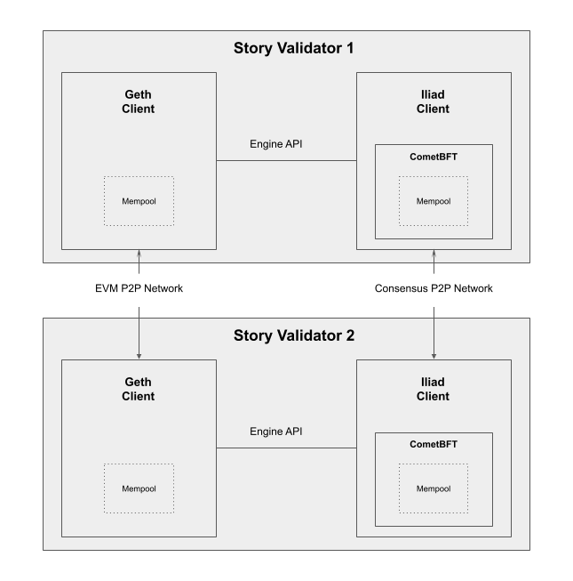

## Story Consesus Implementation

Golang consensus layer implementation and staking contracts for the Story L1 blockchain.

[](https://story.foundation)
[](https://twitter.com/storyprotocol)
[](https://discord.gg/storyprotocol)

You may find pre-built binaries for our latest stable release in our [release page](https://github.com/piplabs/story/releases#latest).

## Architecture

Story draws inspiration from ETH PoS in decoupling execution and consensus clients. The execution client relays EVM blocks into the `story` consesus client via Engine ABI, using an ABCI++ adapter to make EVM state compatible with that of CometBFT. With this architecture, consensus efficiency is no longer bottlenecked by execution transaction throughput.



## Building from source

Building the `story` client requires Go version 1.22 or higher (see `go.mod`), which can be [installed on almost any OS](https://go.dev/doc/install). Once installed, build the binary by running

```bash
go build -o story ./client
```

## Running `story`

### System Requirements

| Component    | Details    |
| ------------- | ---------- |
| CPU           | 4 Cores    |
| RAM           | 32 GB      |
| Disk          | 200 GB     |
| Bandwidth     | 10 MBit/s  |

### Directory Root

The default `story` root folder used for configuring consensus network setup can be found in the following paths:

- **OS X**: `~/Library/Story/story`
- **Linux**: `~/.story/story`
- **Windows**: `%USERPROFILE%\AppData\Roaming\Story\story`

*Note: This directory is located in the same parent directory as the Story execution client directory root.*

### Quick Start

#### Running a node on the Iliad test network

To connect to Iliad, initialize `story` with the `--network iliad` flag, which will generate the genesis file for the Iliad test network:

```bash
./story init --network iliad
```

Afterwards, run the [`story-geth`](https://github.com/piplabs/story-geth) execution client with `iliad` network flag:

```bash
./geth --iliad
```

Now you should be able to sync to the Iliad network with the following:

```bash
./story run
```

#### Running a local network

For quickly spinning up a local network, we recommend initializing `story` with the `--network local` setting, which will define the genesis state of a private local network with a single validator:


```bash
./story init --network local
```

Once done, run the execution client with the `local` network flag:

```bash
./geth --local
```

Now you can sync to your local network running the following:
```bash
./story run
```

### Configuration

By default, network configurations and data are stored relative to the `story` root data folder:

```markdown
story/
├── config/
│ ├── config.toml                  # networking & consesus settings
│ ├── genesis.json                 # blockchain genesis state
│ ├── story.toml                   # client configs
│ ├── node_key.json                # p2p node key  [SENSITIVE]
│ ├── priv_validator_key.json      # validator key [SENSITIVE]
├── data/
│ ├── snapshots/
│ └── priv_validator_state.json    # tracks validator state
```


To use your own custom root directory, you can pass the `--home` flag when initializing and running the node:

- `./story init --home ${YOUR_DATA_DIR}`
   - This will initialize `story` data files in the passed in folder - in case files already exist and you wish to overwrite them, you can add the `--force` suffix
-  `./story run --home ${YOUR_DATA_DIR}`
   - This will spin up the consensus node according to the passed in network and validator configurations

For ensuring synchronization with the execution client, two settings are particularly important:

**__`engine-jwt-endpoint:`__**
This configures the JSON-RPC engine API endpoint, which facilitates commuication between the consensus and execution layer. By default, it is set to `http://localhost:8551`, but may be changed by overriding the value in `story.toml` or through the `--engine-endpoint` CLI flag.

**__`engine-jwt-file:`__**
To authenticate the engine API, a JWT must be passed which is created on execution client initialization. By default, this points to the default execution client JWT file path. For example, if initializing a local network via `story init --local` on Linux, this will default to `~/.story/geth/local/geth/jwtsecret`. To override, either change the value in `story.toml` or by specifying the `--engine-jwt-file` CLI flag.

### Creating a private network

Operating your own private network involves 4 key components:
1. Defining the network genesis state
2. Defining the seed nodes
3. Running the nodes
4. Running validators

*Below, we'll go over each section briefly.*

#### 1. Defining Network Genesis State

By default the consensus genesis state is saved under `story/config/genesis.json`. All nodes MUST share this same state file to be able to communicate with one another. For creating a private network, here are the attributes you will want to consider for modification (referenced using JSON key paths):
- `.chain_id`:
   - uniquely identifies your blockchain
- `.app_state.auth.accounts`:
   - all the staking accounts you wish to provision
- `.app_state.bank.balances`:
   - amount of tokens to prefund for the different staking accounts
- `.app_state.bank.supply`:
   - total supply of tokens to stake - *ensure it's equal to the sum of balances*
- `.app_state.genutil.gentxs`:
   - the validators that should be created on genesis time - for each validator you should make sure to assign an intuitive `moniker` and correct `delegator_address`, `validator_address`, and `pubkey.key`
- `execution_block_hash`:
   - the base64-encoded execution genesis blockhash, whose hex-encoded value can be found by attaching to your execution console via `geth attach $GETH_IPC_PATH` and running `eth.getBlock(0).hash` - *ALWAYS DOUBLE-CHECK THIS VALUE*

#### 2. Defining Seed Nodes

You will need a set of seed nodes for connecting new nodes to the network. Any node can be a seed node, as long as it is discoverable. By default the `story/config/config.toml` file has a set of default seed nodes configured for you to manually override. When running networks locally, these may be set to `${SEED_NODE_ID}@127.0.0.1:${SEED_NODE_PORT}`.

To find your node ID, you can [install cometBFT](https://docs.cometbft.com/v0.37/guides/install) and run `show_node_id --home ${STORY_ROOT_DATA_DIR}`. It is important to note that seed nodes themselves require no seed nodes to be configured.

#### 3. Running Story Nodes

Once your genesis state, network configs, and seed nodes are defined, you can start the network.

First, run your execution client, making sure the path to the engine-API JWT file as well as the genesis state itself is correctly setup on the consesus side. Similar to `story`, you may override the default execution client configs by passing a `--config` flag to your alternate `story-geth` data folder:

```bash
./geth --config ${GETH_ROOT_DATA_DIR}
```

Once done, you should be able to run each of your consensus nodes with the same logic, making sure to pass in the `--home` flag if you used an alternate `story` data folder:

```bash
./story run --home ${STORY_ROOT_DATA_DIR}
```

#### 4. Running Validators

Once the network is setup, you will be able to run validator operations using the validator key generated in `story/data/priv_validator_key.json`. In fact, `story` comes with a `validator` subcommand that allows you to streamline this process. For more information on running validators, read our [official docs](https://docs.story.foundation/docs/what-is-story).

### Contributions

Please see our [contribution guidelines](https://github.com/piplabs/story/blob/ba440c721ec0c187a35a3db370ee494492a4514d/CONTRIBUTING.md).

### Acknowledgements

We would like to express our sincere gratitude to the [Omni](https://github.com/omni-network) team for their valuable research and contributions to the blockchain space. The Story blockchain's CECS (Consensus Execution Client Separation) architecture was influenced by the Omni's team pioneering work on the EVM stakig module using the engine API. Their early efforts showcased the potential of this architecture and served as an inspiration to us. Our initial codebase was, in fact, forked from an early version of their work. 

We built the `story` consensus client leveraging the [Cosmos SDK](https://github.com/cosmos/cosmos-sdk) using [CometBFT](https://github.com/cometbft/cometbft) as the consensus engine. Thanks to all the open source contributors and their wonderful work.

### License

The `story` consensus implementation is licensed under the [GNU Lesser General Public License v3.0](https://www.gnu.org/licenses/lgpl-3.0.en.html).
