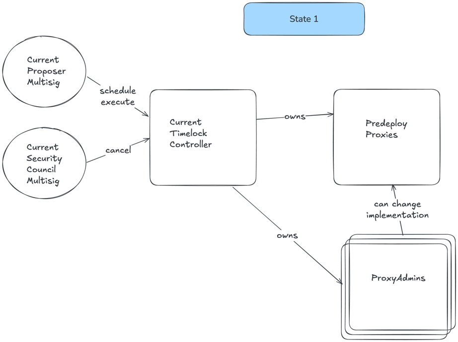
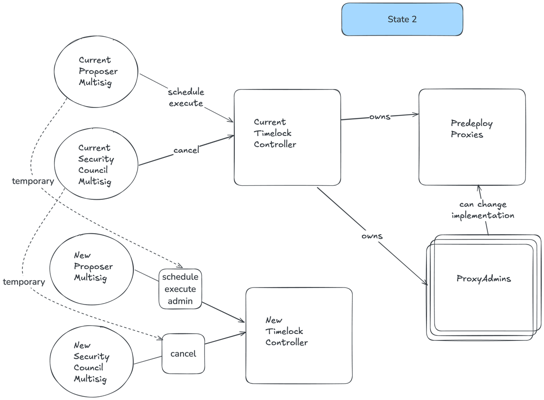
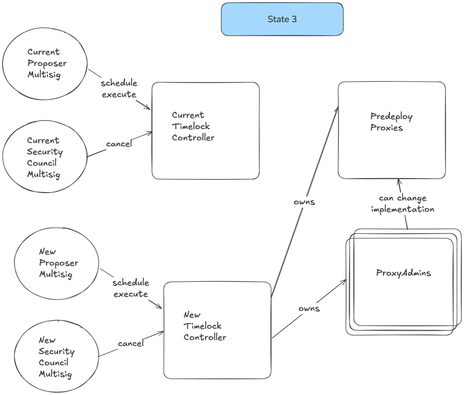
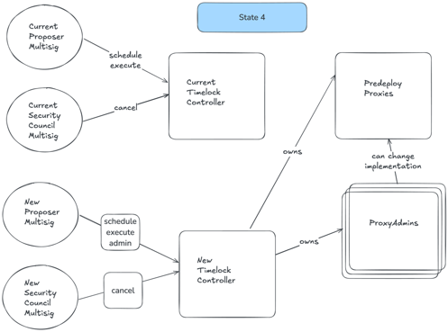

# Migration of current multisig to a Safe

Each step corresponds to a specific script in this directory that generates the necessary transaction payloads for the timelock controllers.

Current Predeploys and their upgradeability are governed by a `TimelockController`, operated by 2 multisigs (Proposer + Security Council)

In order to change that multisig, we need to follow these steps:

## 1. Deploy a new TimelockController
Deploy a new TimelockController governed by the new multisigs (still Proposer + Security Council multisigs, but different technology).
In case the new multisig doesn't work for some reason, the Timelock starts with the old multisig also holding the correspondent roles.
To prevent the need for this operation again, the new Timelock is going to have the proposers be also root admins (to grant roles), at least for some time.

Script: [1.DeployNewTimelock.s.sol](./1.DeployNewTimelock.s.sol)

## 2. Transfer ownership of ProxyAdmins (proxy upgradeability) from old to new TimelockController
This process is split into multiple steps to reduce risk:

### 2.1 Transfer ownership of the first quarter of ProxyAdmins
The old TimelockController transfers ownership of the first quarter of the predeploy ProxyAdmins to the new timelock.

Script: [2.1.TransferOwnershipProxyAdmin1.s.sol](./2.1.TransferOwnershipProxyAdmin1.s.sol)

### 2.2 Transfer ownership of the second quarter of ProxyAdmins
The old TimelockController transfers ownership of the second quarter of predeploy ProxyAdmins to the new timelock.

Script: [2.2.TransferOwnershipProxyAdmin2.s.sol](./2.2.TransferOwnershipProxyAdmin2.s.sol)

### 2.3 Transfer ownership of the third quarter of ProxyAdmins
The old TimelockController transfers ownership of the third quarter of predeploy ProxyAdmins to the new timelock.

Script: [2.3.TransferOwnershipProxyAdmin3.s.sol](./2.3.TransferOwnershipProxyAdmin3.s.sol)

### 2.4 Transfer ownership of the fourth quarter of ProxyAdmins
The old TimelockController transfers ownership of the final quarter of predeploy ProxyAdmins to the new timelock.

Script: [2.4.TransferOwnershipProxyAdmin4.s.sol](./2.4.TransferOwnershipProxyAdmin4.s.sol)

## 3. Transfer ownership of Proxies in use from old to new TimelockController

Transfering these needs 2 steps because they are `Owneable2Step` instead of `Owneable`. New owner must create a transaction calling `acceptOwnership()` to finish the process.

This process is similarly split into multiple steps to reduce risk.

### 3.1 Transfer ownership of the UpgradesEntrypoint
The old TimelockController transfers ownership of the UpgradesEntrypoint proxy to the new timelock.

Script: [3.1.TransferOwnershipUpgradesEntrypoint.s.sol](./3.1.TransferOwnershipUpgradesEntrypoint.s.sol)

### 3.2 Accept ownership of the UpgradesEntrypoint
The new timelock accepts ownership of the UpgradesEntrypoint.

Script: [3.2.ReceiveOwnershipUpgradesEntryPoint.s.sol](./3.2.ReceiveOwnershipUpgradesEntryPoint.s.sol)

### 3.3 Transfer ownership of remaining predeploys
The old TimelockController transfers ownership of IPTokenStaking and UBIPool to the new timelock.

Script: [3.3.TransferOwnershipRestPredeploys.s.sol](./3.3.TransferOwnershipRestPredeploys.s.sol)

### 3.4 Accept ownership of remaining predeploys
The new timelock accepts ownership of IPTokenStaking and UBIPool.

Script: [3.4.ReceiveOwnershipRestPredeploys.s.sol](./3.4.ReceiveOwnershipRestPredeploys.s.sol)

We are now here:

## 4. Finalize the migration
After checking that everything works correctly, old multisigs renounce roles to complete the transition.

Script: [4.RenounceGovernanceRoles.sol](./4.RenounceGovernanceRoles.sol)

