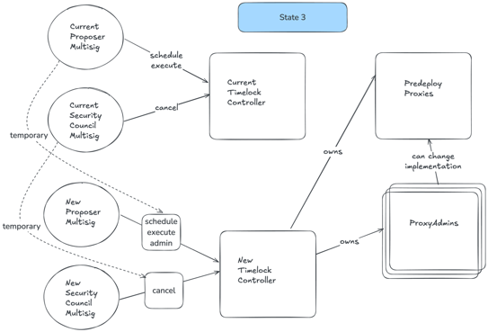

# Migration of current multisig to a Safe

Current Predeploys and their upgradeability are governed by a `TimelockController`, operated by 2 multisigs (Proposer + Security Council)

In order to change that multisig, we need to
1. Deploy a new TimelockController governed by the new multisigs (still Proposer + Security Council multisigs, but different technology).

2. Old TimelockController must transfer ownership of active predeploys and all the predeploy `ProxyAdmin` (contracts that control upgradeability) to new timelock.
Old multisig has to schedule and execute a batch `transferOwnership` call for those contracts in the old TimelockController
3. Active predeploys (`IPTokenStaking`, `UBIPool`, and `UpgradesEntrypoint`) are `Ownable2StepUpgradeable`, so to finish the process the new multisig has to schedule and then execute a batch 

